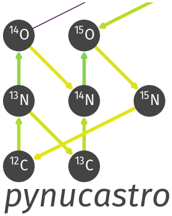

.. pynucastro documentation main file, created by
   sphinx-quickstart on Wed Dec 27 11:54:03 2017.
   You can adapt this file completely to your liking, but it should at least
   contain the root `toctree` directive.

pynucastro
==========

`https://github.com/pynucastro/pynucastro <https://github.com/pynucastro/pynucastro>`_

pynucastro is a python library for nuclear astrophysics.  It provides
access to nuclear data and reaction rates, and tools for building
and interactively exploring nuclear reaction networks.

.. toctree::
   :maxdepth: 1
   :caption: Introduction
   :hidden:

   intro
   rate_types
   install
   contributing

.. toctree::
   :maxdepth:
   :caption: Nuclear Properties
   :hidden:

   sources
   nucleus
   lodders_composition.ipynb

.. toctree::
   :maxdepth: 1
   :caption: pynucastro Overview
   :hidden:

   pynucastro-examples.ipynb
   plot-types.ipynb
   basic_network.ipynb
   pynucastro-integration.ipynb

.. toctree::
   :maxdepth: 1
   :caption: Working with Libraries
   :hidden:

   library-examples.ipynb
   tabulated-weak-rates.ipynb

.. toctree::
   :maxdepth: 1
   :caption: Building Networks
   :hidden:

   duplicate-rates.ipynb
   validate-example.ipynb
   electron-capture-example.ipynb
   electron-captures.ipynb
   alternate-rates.ipynb
   inert-nuclei.ipynb

.. toctree::
   :maxdepth: 1
   :caption: Advanced Rate Operations
   :hidden:

   screening-examples
   modify-example.ipynb
   custom-rates.ipynb
   partition-function

.. toctree::
   :maxdepth: 1
   :caption: Advanced Network Operations
   :hidden:

   approximate-rates
   nse-protons.ipynb
   unimportant-rates.ipynb
   network-cycles.ipynb
   stiffness.ipynb
   reduction.ipynb
   sens_analysis_example.ipynb

.. toctree::
   :maxdepth: 1
   :caption: Nuclear Statistical Equilibrium
   :hidden:

   NSE-example
   NSE-direct-integration
   nse_table

.. toctree::
   :maxdepth: 1
   :caption: Thermodynamics
   :hidden:

   fermi-integrals
   electron-eos

.. toctree::
   :maxdepth: 1
   :caption: Plasma Neutrinos
   :hidden:

   neutrino-cooling.ipynb

.. toctree::
   :maxdepth: 1
   :caption: Exporting Networks
   :hidden:

   networks
   python-network
   simple-cxx-network
   fortran-network
   amrex-astro-cxx-networks
   julia

.. toctree::
   :maxdepth: 1
   :caption: Some Useful Networks
   :hidden:

   he-burning-example

.. toctree::
   :maxdepth: 1
   :caption: Examples in Nuclear Astrophysics
   :hidden:

   examples/binding-energy.ipynb
   examples/pp-cno.ipynb
   examples/hot-CNO-breakout-example.ipynb
   examples/triple_alpha_eval.ipynb
   examples/he-burning.ipynb
   examples/supernova-lightcurve.ipynb

.. toctree::
   :maxdepth: 1
   :caption: Reference
   :hidden:

   citing
   changes
   API <modules>
   zreferences

.. toctree::
   :maxdepth: 1
   :caption: Index
   :hidden:

   genindex
   modindex
